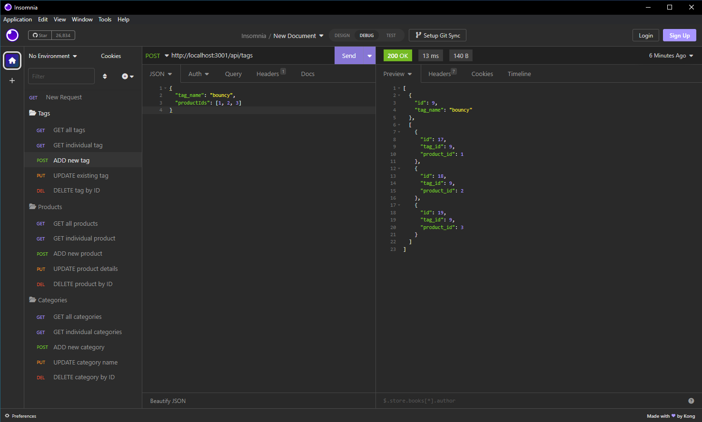

# Joe Commerce Databank - SQL ORM

[](https://opensource.org/licenses/MIT)

## Table of Contents

1. [Description](#description)
2. [Installation](#installation)
3. [Usage](#usage)
4. [License](#license)
5. [Contributing](#contributing)
6. [User Story/Acceptance Criteria](#user-story-and-acceptance-criteria)
7. [Questions](#questions)

## Description

This project does not have a web-based deployment. Instead, this content management system (CMS) is an object-relational mapping (ORM) application.

This application utilizes a SQL database to track store information. It can be used to keep track of and report on the e-commerce store data, as well as providing a simple, easy to use interface for the different API routes. This application will use a Sequelizer back end and Insomnia for front-end and will save, retrieve, update, and delete data from the SQL server database. 

### Mock Up

The screenshot below shows the deployed Command Line Interface, followed by the demo .mp4 which shows it's various levels of functionality.
[](./assets/mockup-demo.png)

[](./assets/joe-commerce-demo.mp4)


### Task Completed
The task here was to complete a project that would allow the user to keep track of e-commerce data in with a user interface that utilizes the custom APIs in this project. Autonomy is essential to become a proficient developer, and saving time by easily storing and retrieving SQL data would aid in those efforts. This challenge should set myself up for future success by applying the core skills I've recently learned, meeting certain acceptance criteria with SQL and Server side APIs. The criteria are documented in the Acceptance Criteria section. 

## Installation

This project is best deployed in Insomnia; an application that allows for interaction with the installation. The application uses MySQL to interact with the data. <b>This app is started with 'npm start' in the console.</b> Remember to first configure the database with ./db/schema.sql when first initiallizing the app. <b>Sample data can be generated by running 'npm run seed'</b>. 

## Usage

This project is meant to provide an easy solution to tracking data  or adding/removing them on the fly. It can save them, delete them, and add tags to better organize data in each member's SQL rows. It uses APIs to save the data to persist. 

## License

[](https://opensource.org/licenses/MIT)

This project is licensed under the MIT license.

## Contributing

To contribute to this repository, simply create a pull request, create issues, or reach out to me (see [Questions](#questions) below). I do my best to ensure that pull requests are up to date. 

## User Story and Acceptance Criteria

### User Story
```
AS A manager at an internet retail company
I WANT a back end for my e-commerce website that uses the latest technologies
SO THAT my company can compete with other e-commerce companies
```

### Acceptance Criteria
```
GIVEN a functional Express.js API
WHEN I add my database name, MySQL username, and MySQL password to an environment variable file
THEN I am able to connect to a database using Sequelize
WHEN I enter schema and seed commands
THEN a development database is created and is seeded with test data
WHEN I enter the command to invoke the application
THEN my server is started and the Sequelize models are synced to the MySQL database
WHEN I open API GET routes in Insomnia Core for categories, products, or tags
THEN the data for each of these routes is displayed in a formatted JSON
WHEN I test API POST, PUT, and DELETE routes in Insomnia Core
THEN I am able to successfully create, update, and delete data in my database
```

## Questions

If you have any questions, reach out to me through either of the methods below:
- [GitHub - J03B](https://github.com/J03B/)
- [email - (byucrazyfan@gmail.com)](mailto:byucrazyfan@gmail.com)
